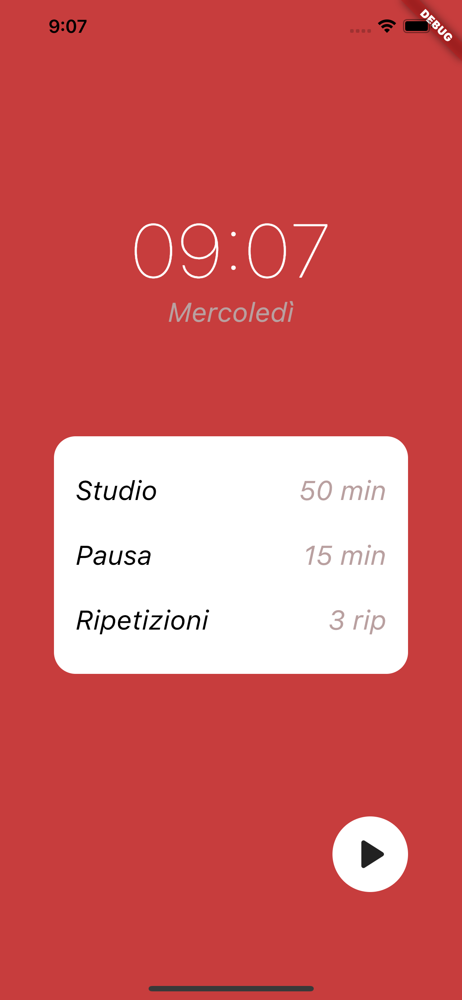
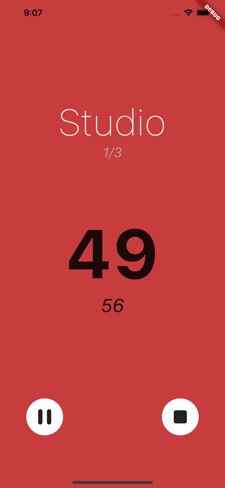
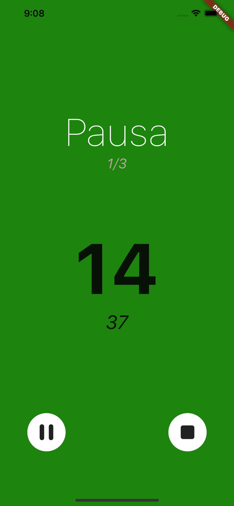

# Pomodoro Timer

Flutter application for the pomodor timer technique.

## Table of contents
* [General info](#general-info)
* [Technologies](#technologies)
* [Setup](#setup)

## General info
This simple app is a time manager for your study journey.
It's based on pomodoro rule that alternates study moments with break moments.

    
    
    

## Technologies
This project is build using flutter [2.10.5](https://docs.flutter.dev/development/tools/sdk/releases) and the following utility libraries:
* [shared_preferences](https://pub.dev/packages/shared_preferences)
* [provider](https://pub.dev/packages/provider)
* [logger](https://pub.dev/packages/logger)

## Setup
Since this app is not published on any stores, to use it you need to:
<ol>
  <li>Download the repository</li>
  <li>Ensure that you have installed flutter 2.10.5</li>
  <li>Go to the main root folder of the project: ..pomodoro_timer/ </li>
  <li>Open terminal and run <code>flutter run</code> </li>
</ol>
  
